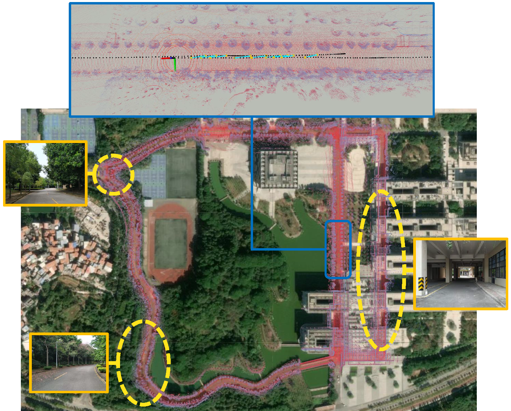
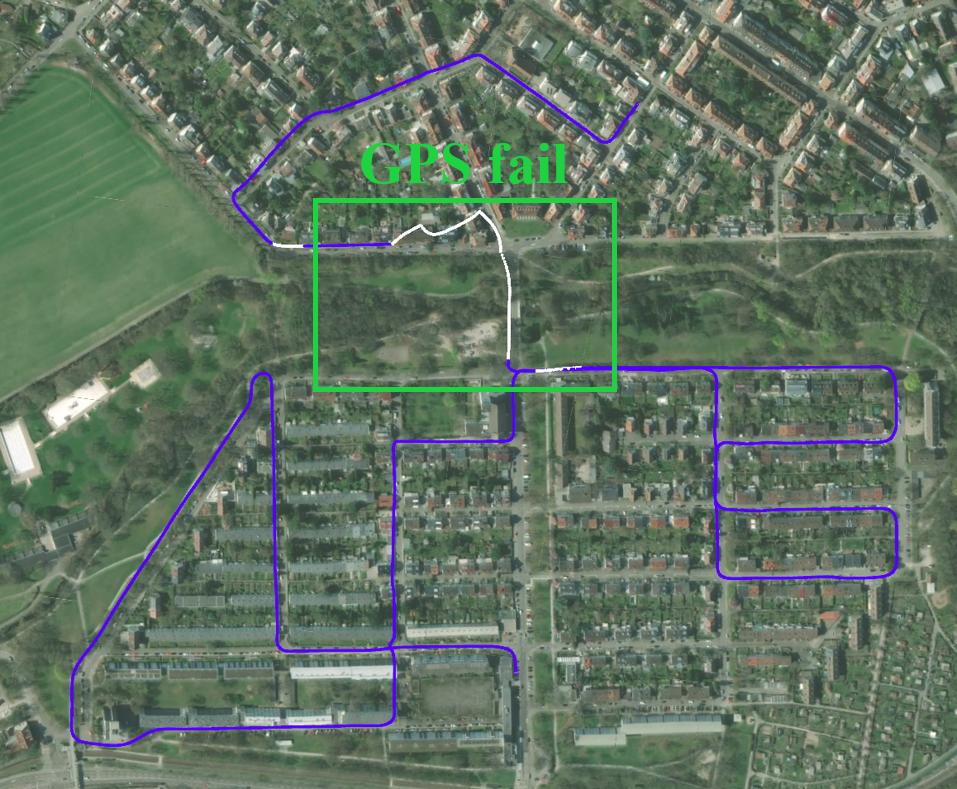
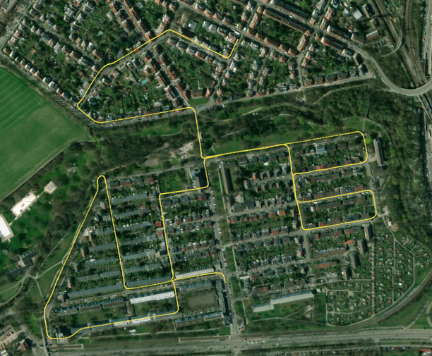
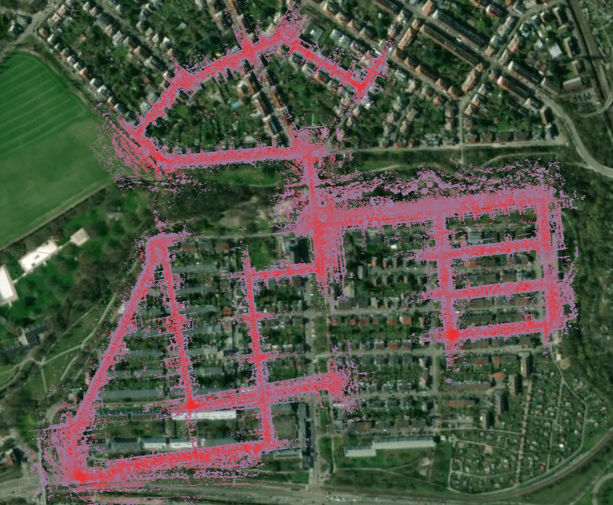
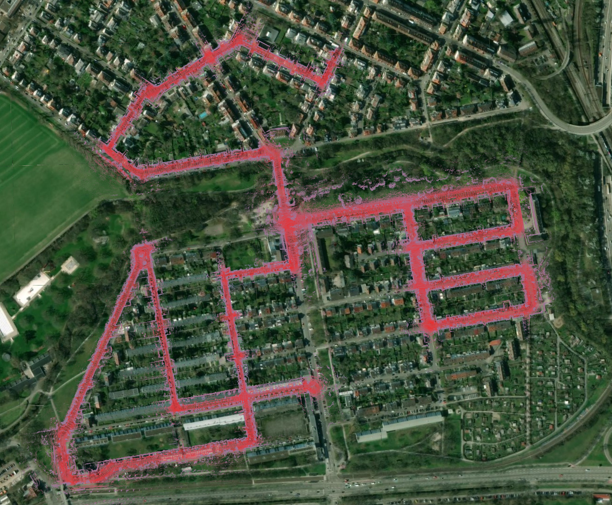
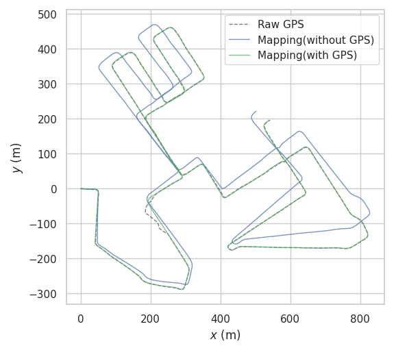
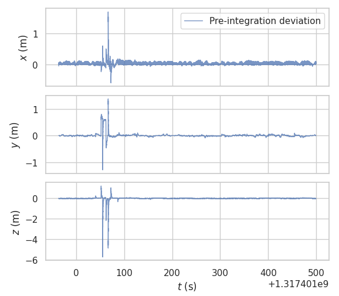

# lins-gps-iris

We propose a system that can fuse IMU, LiDAR and intermittent GPS measurements to achieve high precision localization and mapping in large-scale environment. The Iterated Error-State Kalman Filter (IESKF) is used to fuse IMU and LiDAR measurements to estimate relative motion information quickly. Based on the factor graph, LiDAR, GPS measurements and loop-closure are transformed into constraints for joint-optimization to construct global map. A real-time GPS outlier detection method based on IMU pre-integration theory and residual chi-square test is designed. In addition, the use of robust kernel is supported to implicitly reduce the impact of undetected GPS outliers on the system. A LiDAR-based loop-closure detector is designed, which can search for a pair of point clouds with similar geometric information. 



## System architecture


 The main contributions can be summarized as follows:

1) An IESKF is applied to tightly couple IMU and LiDAR to implement LIO algorithm. The motion information can be estimated by LIO quickly and accurately.

2) A robust and sensitive GPS outlier detection method is proposed. It can detect GPS outliers and reduce the impact of outliers on the system.

3) A lightweight and precise loop-closure detection method is proposed. It can evaluate the similarity between point clouds, and correct the error in pose graph.

## Dependency

* [ROS](http://wiki.ros.org/ROS/Installation) (tested with Melodic)
* [gtsam](https://github.com/borglab/gtsam/releases) (Georgia Tech Smoothing and Mapping library)
* [cloud_msgs](https://github.com/RobustFieldAutonomyLab/LeGO-LOAM/tree/master/cloud_msgs)
* [xw_gps_driver](https://github.com/kuzen/xw_gps_driver)

## Install

```
cd ~/catkin_ws/stc
git clone https://github.com/GDUT-Kyle/lins-gps-iris.git
cd ..
catkin build lins
```

## Notes

1. The system can set the dynamic parameter "useGPSfactor" in the launch file to determine whether it needs to integrate GPS data.
2. If the GPS data is integrated, the user needs to calibrate the GPS module and the external parameters of the LiDAR in advance.
3. After setting "SaveMap" to true, the mapping module of this system can save the feature point map for relocation.
4. In this system, GPS data is our custom ROS message type, users can refer to [xw_gps_driver](https://github.com/kuzen/xw_gps_driver).

## Sample datasets

**Our own collected datasets contain high-precision mapping information. Since we do not have surveying and mapping qualifications, we do not share the dataset due to legal issues.**

## Run

### A. Mapping

```
roslaunch lins imuOdometry.launch
roslaunch lins run_port_exp.launch
```

### B. Localization

```
roslaunch lins localization.launch
```

## Experimental results

### A. GPS-Challenge environment test (KITTI)



<center>(a) Raw GPS measurements</center>



<center>(b) Proposed method (with GPS)</center>



<center>(c) Mapping (without GPS)</center>



<center>(d) Mapping (with GPS)</center>





### B. Loop-Closure test


## References

[LeGO-LOAM](https://github.com/RobustFieldAutonomyLab/LeGO-LOAM)

[LINS---LiDAR-inertial-SLAM](https://github.com/ChaoqinRobotics/LINS---LiDAR-inertial-SLAM)

[SC-LeGO-LOAM](https://github.com/irapkaist/SC-LeGO-LOAM)

[LiDAR-Iris](https://github.com/JoestarK/LiDAR-Iris)


